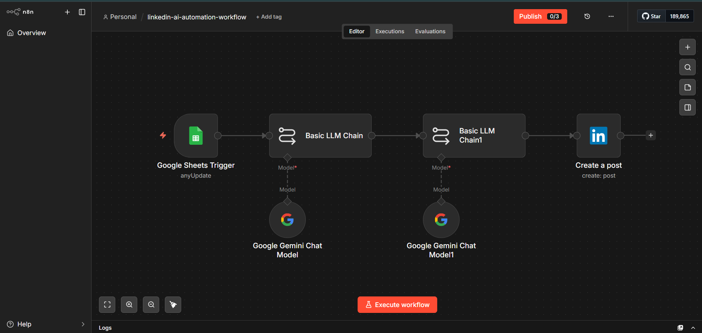

# 🚀 AI-Powered LinkedIn Content Automation Workflow

## 📌 Overview
This project is an AI-powered automation system that automatically generates and publishes LinkedIn posts using:

- n8n (Workflow Automation)
- Google Sheets (Input Source)
- Gemini AI (Google Generative AI Model)
- LinkedIn API (Post Publishing)

It removes manual effort in content creation and posting by fully automating the workflow from input to final LinkedIn publication.

---

## 🎯 Problem Statement
Creating LinkedIn posts manually involves:

- Writing content from scratch  
- Formatting and adding hashtags  
- Posting manually every time  
- Maintaining consistency  

This process is time-consuming and repetitive, especially for professionals and content creators.

---

## 💡 Solution
This project automates the entire workflow using AI + automation:

- Takes input topics from Google Sheets  
- Generates professional posts using Gemini AI  
- Formats and optimizes content automatically  
- Publishes directly to LinkedIn  

---

## 🔄 Workflow Architecture

### AI LinkedIn Automation Flow:
Google Sheets → n8n Trigger → Gemini AI (LLM Chain) → Content Processing → LinkedIn API → Post Published

---

## 📸 Workflow Preview

  

---

## 🛠️ Tech Stack

- **n8n** – Workflow automation platform  
- **Google Sheets** – Data input source  
- **Gemini AI** – Content generation model  
- **LinkedIn API** – Post publishing integration  

---

## ⚙️ How It Works

1. Add a topic or idea in Google Sheets  
2. n8n detects new or updated rows (Trigger)  
3. Gemini AI generates a LinkedIn post  
4. Content is refined and formatted  
5. Final post is published automatically on LinkedIn  

---

## 🧩 Key Features

- Fully automated LinkedIn post generation  
- AI-powered content creation  
- No-code workflow using n8n  
- Real-time automation  
- Scalable architecture for multi-platform posting  

---

## 📅 Trigger Types

- Manual Trigger (testing phase)  
- Event-based Trigger (Google Sheets updates)  
- Scheduled Trigger (time-based automation)  

---

## 🧠 What I Learned

- Building end-to-end AI workflows using n8n  
- Integrating Gemini AI into automation systems  
- Working with REST APIs (LinkedIn API)  
- Designing scalable automation architectures  
- Debugging and optimizing workflow systems  

---

## ⚠️ Challenges Faced

- LinkedIn API authentication setup  
- Prompt optimization for better AI outputs  
- Debugging workflow execution in n8n  
- Handling API rate limits and responses  

---

## 🚀 Future Improvements

- Multi-platform posting (Twitter, Instagram, etc.)  
- Analytics dashboard for post performance  
- Smarter AI prompt optimization loop  
- Content scheduling system  
- Engagement tracking system  

---

## 👨‍💻 Author

**Anvitha P**  
BTech Computer Science Engineering  
Sri Vasavi Engineering College, Tadepalligudem  

---

## ⭐ Outcome

This project demonstrates how AI and workflow automation can eliminate manual social media tasks and improve productivity using modern tools like n8n and Gemini AI.

It is a strong example of:
- AI integration  
- No-code automation  
- API-based workflow design  
- Real-world productivity automation  

---

## 📂 Repository Info

- Public repository  
- No releases published yet  
- Workflow JSON included (`linkedin-ai-automation-workflow.json`)  

---
